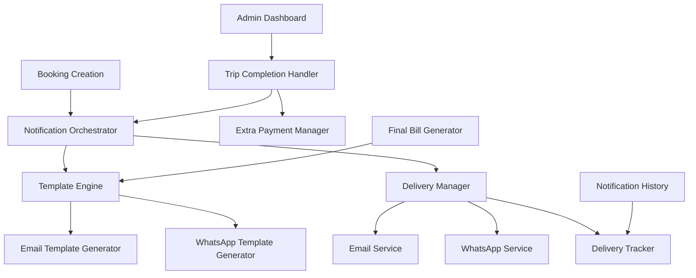

# Design Document

## Overview

The Booking Notification System enhances the existing booking workflow by implementing a comprehensive notification infrastructure that provides consistent, professional communication throughout the booking lifecycle. The system leverages the existing booking-summary-card UI design to ensure visual consistency across all notification channels (email and WhatsApp) while integrating seamlessly with the current admin dashboard for efficient booking management.

## Architecture

### System Components



### Data Flow

1. **Booking Confirmation Flow**: Booking Creation → Notification Orchestrator → Template Generation → Multi-channel Delivery
2. **Admin Notification Flow**: Booking Creation → Admin Notification Generator → Email Delivery → Dashboard Integration
3. **Trip Completion Flow**: Admin Action → Trip Completion Handler → Extra Payment Processing → Final Bill Generation → Notification Delivery
4. **Delivery Tracking Flow**: All Notifications → Delivery Tracker → Status Updates → Admin Dashboard

## Components and Interfaces

### 1. Notification Orchestrator

**Purpose**: Central coordinator for all booking-related notifications

**Interface**:
```python
class NotificationOrchestrator:
    def send_booking_confirmation(booking: Booking) -> NotificationResult
    def send_admin_notification(booking: Booking) -> NotificationResult
    def send_final_bill(booking: Booking, extra_payments: List[ExtraPayment]) -> NotificationResult
    def resend_notification(notification_id: str) -> NotificationResult
```

**Responsibilities**:
- Coordinate notification sending across multiple channels
- Handle notification timing and sequencing
- Manage notification preferences and settings
- Track delivery status and retry failed notifications

### 2. Template Engine

**Purpose**: Generate consistent booking-summary-card templates for all notification types

**Interface**:
```python
class BookingTemplateEngine:
    def generate_confirmation_template(booking: Booking, format: str) -> Template
    def generate_admin_template(booking: Booking, format: str) -> Template
    def generate_final_bill_template(booking: Booking, extra_payments: List) -> Template
    def render_booking_summary_card(booking: Booking, context: dict) -> str
```

**Template Types**:
- **Confirmation Template**: For traveler booking confirmations
- **Admin Template**: For admin notifications with management links
- **Final Bill Template**: For completed trip billing
- **Update Template**: For booking status changes

### 3. Enhanced Email Service

**Purpose**: Send HTML emails with booking-summary-card design

**Enhancements**:
- Inline CSS for email client compatibility
- Mobile-responsive design
- Action buttons with tracking
- Plain text fallbacks
- Delivery status tracking

**New Methods**:
```python
def send_booking_summary_email(booking: Booking, template_type: str, recipient: str) -> EmailResult
def generate_booking_summary_html(booking: Booking, context: dict) -> str
def track_email_engagement(email_id: str) -> EngagementMetrics
```

### 4. Enhanced WhatsApp Service

**Purpose**: Send formatted WhatsApp messages with booking summaries

**Enhancements**:
- Structured message formatting
- Emoji-based status indicators
- Mobile-optimized layout
- Quick action buttons
- Link previews for booking details

**New Methods**:
```python
def send_booking_summary_whatsapp(booking: Booking, template_type: str, phone: str) -> WhatsAppResult
def format_booking_summary_message(booking: Booking, context: dict) -> str
def send_quick_action_message(booking: Booking, actions: List[str]) -> WhatsAppResult
```

### 5. Trip Completion Handler

**Purpose**: Manage trip completion workflow and extra payment processing

**Interface**:
```python
class TripCompletionHandler:
    def mark_trip_completed(booking_id: str, admin_user: User) -> CompletionResult
    def add_extra_payment(booking_id: str, amount: Decimal, description: str) -> PaymentResult
    def generate_final_bill(booking_id: str) -> BillResult
    def send_completion_notifications(booking_id: str) -> NotificationResult
```

**Workflow**:
1. Admin marks trip as completed
2. System prompts for extra payments (optional)
3. Final bill calculation with all charges
4. Automatic notification to traveler
5. Status update in admin dashboard

### 6. Delivery Tracker

**Purpose**: Track notification delivery status and provide analytics

**Interface**:
```python
class DeliveryTracker:
    def track_delivery(notification_id: str, channel: str, status: str) -> None
    def get_delivery_status(notification_id: str) -> DeliveryStatus
    def get_booking_notification_history(booking_id: str) -> List[NotificationRecord]
    def retry_failed_delivery(notification_id: str) -> RetryResult
```

**Tracking Metrics**:
- Delivery timestamps
- Success/failure rates
- Email open rates
- Link click tracking
- Channel performance

## Data Models

### Enhanced Booking Model

```python
class Booking(models.Model):
    # Existing fields...
    
    # New notification-related fields
    notification_preferences = models.JSONField(default=dict)
    last_notification_sent = models.DateTimeField(null=True, blank=True)
    notification_count = models.IntegerField(default=0)
    
    def get_notification_context(self) -> dict:
        """Generate context for notification templates"""
        pass
    
    def calculate_final_bill(self) -> dict:
        """Calculate final bill including extra payments"""
        pass
```

### New Models

```python
class ExtraPayment(models.Model):
    booking = models.ForeignKey(Booking, on_delete=models.CASCADE)
    amount = models.DecimalField(max_digits=10, decimal_places=2)
    description = models.CharField(max_length=255)
    added_by = models.ForeignKey(User, on_delete=models.SET_NULL, null=True)
    added_at = models.DateTimeField(auto_now_add=True)
    is_paid = models.BooleanField(default=False)

class NotificationRecord(models.Model):
    booking = models.ForeignKey(Booking, on_delete=models.CASCADE)
    notification_type = models.CharField(max_length=50)
    channel = models.CharField(max_length=20)  # email, whatsapp
    recipient = models.CharField(max_length=255)
    status = models.CharField(max_length=20)  # sent, delivered, failed, opened
    sent_at = models.DateTimeField(auto_now_add=True)
    delivered_at = models.DateTimeField(null=True, blank=True)
    opened_at = models.DateTimeField(null=True, blank=True)
    error_message = models.TextField(blank=True, null=True)

class NotificationTemplate(models.Model):
    name = models.CharField(max_length=100)
    template_type = models.CharField(max_length=50)
    channel = models.CharField(max_length=20)
    subject_template = models.CharField(max_length=255)
    body_template = models.TextField()
    is_active = models.BooleanField(default=True)
```

## Correctness Properties

*A property is a characteristic or behavior that should hold true across all valid executions of a system-essentially, a formal statement about what the system should do. Properties serve as the bridge between human-readable specifications and machine-verifiable correctness guarantees.*

### Property 1: Notification Delivery Consistency
*For any* booking creation, confirmation notifications should be sent to both traveler and admin within the configured time window
**Validates: Requirements 1.1, 2.1**

### Property 2: Template UI Consistency
*For any* notification sent, the booking-summary-card design should be consistently applied across all channels and notification types
**Validates: Requirements 5.1, 5.2, 5.3, 5.4, 5.5, 5.6, 5.7**

### Property 3: Admin Link Functionality
*For any* admin notification sent, the management link should direct to the correct booking detail page with proper authentication
**Validates: Requirements 2.4, 2.5, 8.1, 8.2**

### Property 4: Trip Completion Workflow
*For any* trip marked as completed, the system should calculate final bill, send notifications, and update booking status atomically
**Validates: Requirements 3.1, 3.4, 3.5, 4.1, 4.6**

### Property 5: Extra Payment Integration
*For any* extra payment added to a completed trip, the final bill should reflect the updated total and trigger appropriate notifications
**Validates: Requirements 3.2, 3.3, 4.3, 4.4, 9.1, 9.2, 9.3**

### Property 6: Notification Content Completeness
*For any* booking notification, all required booking information should be included and properly formatted
**Validates: Requirements 1.3, 2.3, 4.2, 4.3, 4.4**

### Property 7: Delivery Status Tracking
*For any* notification sent, delivery status should be tracked and made available in the admin dashboard
**Validates: Requirements 10.1, 10.2, 10.3, 10.5, 10.6**

### Property 8: Multi-channel Delivery
*For any* notification request, the system should attempt delivery via all configured channels and track individual channel success
**Validates: Requirements 1.5, 6.1, 7.1**

### Property 9: Email Rendering Consistency
*For any* HTML email generated, the booking-summary-card should render correctly across different email clients
**Validates: Requirements 6.1, 6.2, 6.6**

### Property 10: Retry Mechanism Reliability
*For any* failed notification delivery, the system should retry with exponential backoff and track retry attempts
**Validates: Requirements 10.7**

## Error Handling

### Notification Delivery Failures
- **Email Failures**: Retry with exponential backoff, fallback to admin notification
- **WhatsApp Failures**: Log error, attempt alternative phone format, notify admin
- **Template Rendering Errors**: Use fallback template, log error for debugging
- **Network Timeouts**: Implement circuit breaker pattern, queue for retry

### Data Consistency Issues
- **Booking State Conflicts**: Use database transactions for atomic updates
- **Payment Calculation Errors**: Validate calculations, log discrepancies
- **Template Data Missing**: Provide default values, graceful degradation

### Integration Failures
- **Admin Dashboard Unavailable**: Cache notification data, sync when available
- **External Service Outages**: Queue notifications, process when service restored
- **Authentication Failures**: Refresh tokens, fallback to basic notifications

## Testing Strategy

### Unit Testing
- Template generation with various booking types
- Notification delivery logic for different channels
- Error handling for service failures
- Payment calculation accuracy
- Admin workflow state transitions

### Property-Based Testing
- **Notification Consistency**: Test template rendering across all booking types and channels
- **Delivery Reliability**: Test notification delivery under various failure scenarios
- **Data Integrity**: Test booking state consistency during completion workflow
- **UI Consistency**: Test booking-summary-card rendering with random booking data
- **Payment Accuracy**: Test final bill calculations with various extra payment scenarios

### Integration Testing
- End-to-end booking confirmation flow
- Admin notification to dashboard workflow
- Trip completion with extra payments
- Multi-channel notification delivery
- Delivery tracking and retry mechanisms

### Performance Testing
- Notification throughput under high booking volume
- Template rendering performance with complex bookings
- Database query optimization for notification history
- Email delivery rate limits and queuing

**Testing Configuration**:
- Minimum 100 iterations per property test
- Each property test tagged with: **Feature: booking-notification-system, Property {number}: {property_text}**
- Mock external services for reliable testing
- Test data generators for various booking scenarios